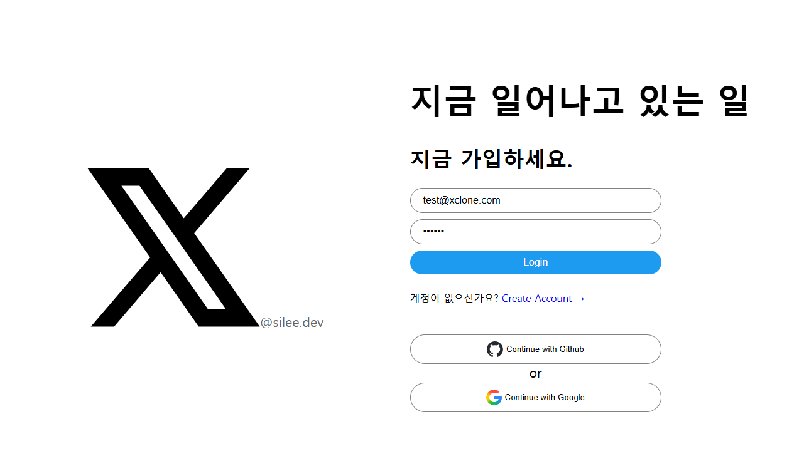

# X 클론코딩 (구 트위터 클론 프로젝트)

---




- 👉 배포 URL : **[https://x-clone-d17bb.web.app](https://x-clone-d17bb.web.app)**  
- 🧪 테스트 계정  

- 이메일: `test@xclone.com`  
- 비밀번호: `123456`

---

## 프로젝트 소개

> 트위터의 핵심 기능을 직접 구현한 **SNS 클론 프로젝트**입니다.  
> Firebase를 기반으로 사용자 인증, 트윗 작성/삭제, 이미지 업로드, 실시간 타임라인 등 
> **실제 서비스에 준하는 구조와 기능을 구현**하였고, Firebase Hosting을 통해 배포까지 완료했습니다.

---

## 1. 개발 목적

백엔드 중심의 경험에서 벗어나 **프론트엔드 기술 스택과 클라우드 서비스에 대한 이해를 넓히기 위해** 진행한 사이드 프로젝트입니다.  
특히 **서버리스 환경과 NoSQL 데이터 구조**, 그리고 **React 기반 컴포넌트 설계**에 초점을 두었습니다.

### 📌 주요 학습 및 적용 기술

- **React**
  - 컴포넌트 기반 구조로 **재사용성과 유지보수성**을 고려한 설계
  - 사이드 메뉴, 트윗, 댓글, 모달 등을 **역할 단위로 분리**하여 리소스 절약 및 확장 용이성 확보

- **TypeScript**
  - 기존 백엔드(.NET) 경험을 살려 타입 안정성을 유지하며 개발
  - 프론트엔드 단독 프로젝트에서도 **정적 타입 시스템을 적용해 오류 사전 방지**
  - 서버리스 구조에서의 **모델링 & 인터페이스 설계** 연습

- **Firebase (서버리스 백엔드)**
  - **Auth**: GitHub, Google 로그인 연동 및 Firestore 사용자 문서 생성
  - **Firestore**: 트윗, 댓글, 팔로우, 북마크 등 NoSQL 구조 설계 및 실시간 데이터 처리 (`onSnapshot`)
  - **Storage**: 이미지 업로드 및 게시물과 연동
  - **Hosting**: Vite 기반 앱을 간편하게 배포

- **NoSQL 구조**
  - 정규화된 관계형 데이터가 아닌, **문서 중심 설계** 학습
  - 팔로우, 좋아요, 북마크 등은 **서브컬렉션 분리**로 구성하여 확장성 고려

---

이 프로젝트를 통해 프론트엔드 중심의 기술 흐름에 익숙해지고,  
**React + Firebase 조합으로도 충분히 동적인 SNS 구현이 가능함을 직접 체험**할 수 있었습니다.

---


## 2. 사용 기술

### 🎨 프론트엔드
<p>
  
  
  
  
</p>

### 🔐 인증 / 📦 DB / ☁️ 저장소
<p>
  
  
  
</p>

### 🚀 배포
<p>
  
</p>

---


## 📁 프로젝트 폴더 구조

```
.
├── App.tsx                  # 전체 라우터 및 전역 모달/레이아웃 구성
├── firebase.ts              # Firebase 초기화 (Auth, Firestore, Storage)
├── main.tsx                 # 앱 엔트리 포인트 (ReactDOM)
├── vite-env.d.ts            # Vite 환경 타입 설정
├── components/              # 재사용 가능한 컴포넌트 모음
│   ├── auth-components.ts           # 로그인/회원가입 UI 스타일 요소
│   ├── emoji-picker.tsx             # emoji-mart 연동 이모지 선택기
│   ├── github-btn.tsx               # GitHub OAuth 버튼
│   ├── google-btn.tsx               # Google OAuth 버튼
│   ├── layout.tsx                   # 페이지 공통 레이아웃 (사이드바 포함)
│   ├── loading-screen.tsx          # 이미지 로딩 시 뷰어
│   ├── post-tweet-form.tsx         # 트윗 작성 입력창
│   ├── protected-route.tsx         # 로그인 여부에 따른 라우팅 보호
│   ├── serach-result-item.tsx      # 유저 검색 결과 항목
│   ├── use-follow-toggle.ts        # 팔로우/언팔로우 토글 커스텀 훅
│   ├── user-info.ts                # 사용자 정보 fetch 전용 훅
│   ├── design/                     # 디자인 스타일 분리 (tailwind 기반)
│   │   ├── home-design.ts          # 홈(타임라인) 관련 스타일
│   │   ├── layout-menu-design.ts   # 메뉴/네비게이션 스타일
│   │   ├── modal-design.ts         # 모달 컴포넌트 스타일
│   │   ├── post-tweet-form-design.ts # 트윗 작성폼 스타일
│   │   ├── profile-design.ts       # 프로필 페이지 스타일
│   │   ├── tweet-design.ts         # 트윗 레이아웃 스타일
│   │   └── tweet-select-design.ts  # 트윗 선택 관련 스타일
│   ├── modal/                      # 모달 컴포넌트 모음
│   │   ├── edit-modal-handle.tsx       # @handle 수정 모달
│   │   ├── edit-modal-logout.tsx       # 로그아웃 확인 모달
│   │   ├── edit-modal-profilename.tsx  # 프로필 이름 수정 모달
│   │   ├── edit-modal-reply.tsx        # 댓글 작성 모달
│   │   └── edit-modal-tweet.tsx        # 트윗 수정 모달
│   ├── nav/                        # 좌우 사이드 메뉴 컴포넌트
│   │   ├── left-nav.tsx               # 왼쪽 내비게이션 (홈/프로필 등)
│   │   ├── right-nav-suggest.tsx      # 추천 사용자 리스트
│   │   └── right-nav.tsx              # 우측 사이드 요소
│   └── tweet/                      # 트윗/댓글 관련 컴포넌트
│       ├── timeline.tsx               # 타임라인 렌더링
│       ├── tweet-bookmark.tsx        # 북마크 토글
│       ├── tweet-delete.tsx          # 트윗 삭제 처리
│       ├── tweet-edit.tsx            # 트윗 수정 처리
│       ├── tweet-likes.tsx           # 좋아요 버튼
│       ├── tweet-reply-btn.tsx       # 댓글 버튼
│       ├── tweet-reply-delete.tsx    # 댓글 삭제
│       ├── tweet-reply-edit.tsx      # 댓글 수정
│       ├── tweet-reply-list.tsx      # 댓글 리스트 출력
│       ├── tweet-reply.tsx           # 댓글 컴포넌트
│       ├── tweet-select.tsx          # 트윗 선택 시 옵션
│       └── tweet.tsx                 # 트윗 기본 출력 컴포넌트
├── routes/                  # 라우팅되는 페이지 단위 컴포넌트
│   ├── create-account.tsx      # 이메일 회원가입 페이지
│   ├── home.tsx                # 메인 타임라인 페이지
│   ├── login.tsx               # 로그인 페이지
│   └── profile.tsx             # 사용자 프로필 페이지
```


---

## 📄 페이지 별 기능

---

### 🔹 [초기화면 - 로그인 및 진입]
- Firebase `Auth` 기반 로그인 시스템
- GitHub / Google 로그인 (OAuth 연동)
- 이메일 계정 로그인 / 회원가입 전환 가능
- 로그인 성공 시 Firestore에 사용자 문서 생성
- 로그인 상태 확인 후 `Loader` 화면 표시

| 초기화면 |
|----------|
||

---

### 🔹 [회원가입 페이지]
- 이메일 / 비밀번호 기반 회원가입
- 최초 가입 시 Firestore에 사용자 문서 (`users/{uid}`) 생성
- 랜덤 `@handle` 자동 생성 및 수정 가능
- 닉네임 / 핸들 / 프로필 이미지 등록 가능

| 회원가입 |
|----------|
||

---

### 🔹 [홈 화면 - 타임라인]
- 실시간 트윗 피드 (`onSnapshot`)
- 팔로잉 모드 / 추천 트윗 모드 전환 가능
- 트윗 작성 (텍스트, 이모지, 이미지)
- 좋아요 / 댓글 / 북마크 / 삭제 기능

---

### 🔹 [트윗 작성 및 수정]
- 텍스트 + 이미지 업로드 + 이모지 삽입 (`emoji-mart`)
- 작성된 트윗은 Firestore에 저장 및 이미지 업로드 (Firebase Storage)
- 작성 중 업로드/로딩 상태 표시

> 트윗 작성, 그 자리에서 수정까지 gif 준비

### 🔹 [팔로우 기능]
- 추천 사용자 목록 노출 (우측 사이드바)
- 팔로우 / 언팔로우 토글 버튼
- Firestore 내 `following`, `followers` 관계 저장
- 팔로잉한 유저 트윗만 보는 타임라인 필터 가능

---

### 🔹 [검색 기능]
- 사용자 검색 (Firestore에서 `handle` 또는 `name` 기반)
- 검색결과 목록을 렌더링하여 프로필 진입 가능

---

---

### 🔹 [좋아요 기능]
- 각 트윗 좋아요 추가/해제
- Firestore 내 `likes` 서브컬렉션 저장 및 UI 반영

---

### 🔹 [북마크 기능]
- 각 트윗 별 북마크 추가/해제
- 내 북마크 모음 탭 별도 존재
- Firestore 서브컬렉션 `bookmarks`에 저장

---

### 🔹 [Tweet 상세 - 댓글 기능]
- 트윗별 댓글 작성 가능 (모달 입력창)
- 댓글 실시간 렌더링 및 수정/삭제 지원
- 댓글 수 UI에 표시

---

### 🔹 [프로필 페이지]
- 내 정보 (이름, @handle, 프로필 이미지 등) 표시
- 프로필 정보 수정 (모달로 구현)
- 내 트윗 / 북마크 탭 전환
- 팔로우 / 언팔로우 상태 확인 및 반영

---
